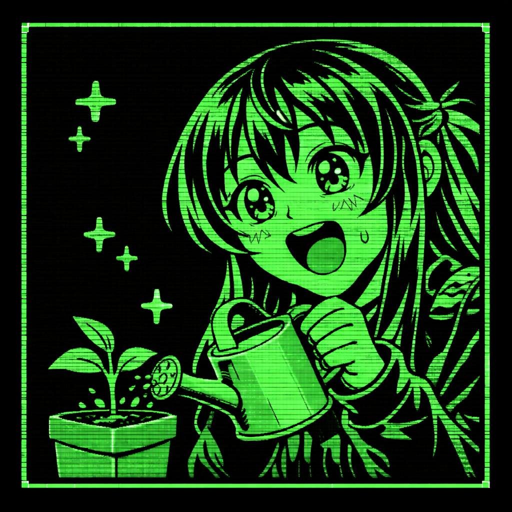

# Enter The Market (Web)

Welcome, market legend in the making.


This is a browser farming + trading game where you mine, plant, water, harvest, and try to outsmart the market one day at a time.

## Why This Is Fun


- Grow crops on a 9x9 farm.
- Watch prices shift daily.
- React to weekly news events.
- Complete goals for tools, crop unlocks, and flashy cosmetics.
- Climb from humble seeds to luxury-tier progression.

## Core Features


- Tools: glove, watering can, pickaxe.
- Goals: single-condition and multi-condition goals.
- Progression: tier-locked crops (`goalLocked`) unlocked through goals.
- Market simulation: only unlocked crops are affected by daily pricing/news.
- Cosmetics: multiple themes, including high-end milestone themes.

## Quick Start


If you just want to play, use the hosted version: https://youngwiseone.github.io/enter_the_market_web/

Double-click `index.html` to launch the game locally in your browser.

If you want to host it with a local server instead, that works too.

Example:

```bash
python -m http.server 8000
```

## Project Map


- `index.html`: UI shell + CSS
- `main.js`: game logic/state/rendering
- `data/items.json`: item definitions + prices + locks
- `data/goals.json`: goals + rewards
- `data/news.json`: market news templates
- `guide/`: content authoring guides

## Save Data


- Saves are stored in browser `localStorage`.
- Use the in-game reset when you want a fresh run.

## License


This project uses a custom license in `LICENSE.md`.
For AI/automation-specific guidance, see `llms.txt`.

Short version:
- You can use the code to build your own project (including commercial).
- You cannot rehost this game unchanged (including bot-driven scrape/clone/re-upload mirrors).
- If you want to host this exact game as-is, ask for written permission first.

## If You Edit Content



- Keep IDs stable (`item.id`, `goal.id`, cosmetic ids).
- Update both JSON data and fallback defaults in `main.js` when changing progression.
- Validate after edits:
```bash
node --check main.js
```

Now go break the market (responsibly).
